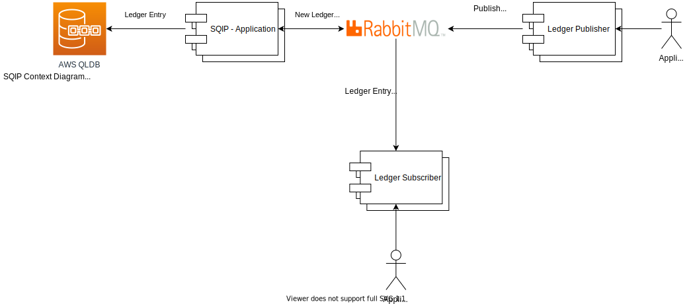

# SQIP 
(Pronounced as 'skip')

SQIP is a Python application aimed at generalize/standardize the interactions with QLDB so that the applications have a common interface for writing auditable data.  

The developer interface for interacting with qldb is a message queue not the SQIP application itself.  By using a message queue the application will be able to dump the data and have confidence their data is completed.  SQIP will be able to pull off the message queue, format the payload to write to QLDB and mark the message queue as job complete.  The gaurantees you get are: 
- gauranteed eventual consistency
- common interface for developers
- tooling agnostic
- standardization of logging and managing auditable data
- scalability and confidence in your audits



# Code

#### Python Environment
The development workflow uses [pipenv](https://github.com/pypa/pipenv) to manage the virtual environments.  

#### File Structure
```
|--.github - github actions
├── app - sqip application
│   └── providers - integration providers
└── infrastructure - all environment deployments
    ├── helm 
    │   └── SQIP
    │       ├── charts
    │       └── templates
    │           └── tests
    └── terraform
```

The `app` directory contains a Flask application, run the application:

```shell script
$ pipenv install --dev # init env for development
$ pipenv shell
$ export FLASK_APP=app
$ export FLASK_ENV=development
$ flask run
 * Serving Flask app "app" (lazy loading)
 * Environment: development
 * Debug mode: on
 * Running on http://127.0.0.1:5000/ (Press CTRL+C to quit)
 * Restarting with stat
 * Debugger is active!
 * Debugger PIN: 326-874-135
```

Check the `version` API:

```shell script
$ curl http://127.0.0.1:5000/publish/version
0.0.1
```

Swagger API docs available at:
```shell script
http://127.0.0.1:5000/
```

Run Tests
Open a new terminal window and run the flask app (see above), the run:
```shell script
$ pipenv shell
$ pytest
```
Or
```shell script
$ pipenv run pytest
```


# Design


## Use Case Diagram


## Package Diagram


## Class Diagram


# Future

In the future we would love to have a provider system that allows for different queue mechanisms and backend database's or services.  